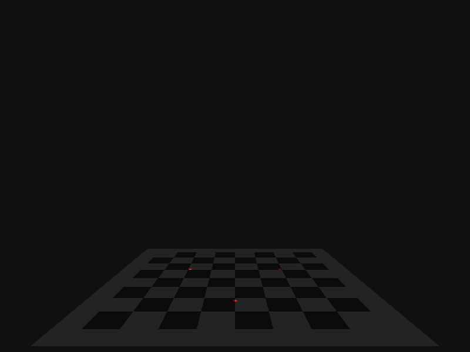

#3D Printing Notes

Playing around with iJulia and some 3D printing concepts, mostly
centering around calibrating a delta bot for the time being.

## Requirements
* iJulia
* POVRay

## What happens
When you run the iJulia notebook, it creates an internal model of
a 3D printer with lasers attached to it. It then simulates a photo
of a calibration standard (chessboard) with the lasers shining on
it.

